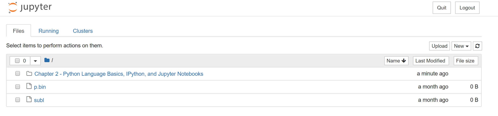

# Python Language Basics, IPython, and Jupyter Notebooks

* * *

* Python is an ideal language for rapidly whipping your data into shape

* The greater your facility with Python the language, the easier it will be for you to prepare new datasets for analysis

**The Python Interpreter**

* Python is an interpreted language

* It runs a program by executing one statement at a time

**IPython Basics**

* We’ll get up and running with IPython shell and Jupyter notebook, and introduce you to some of the essential concepts.

* The first two lines are Python code statements; the second statement creates a variable named *data* that refers to a newly created Python dictionary. The last line prints the value of *data *in the console.

**Running the Jupyter Notebook**

* One of the major components of the Jupyter project is *notebook*, a type of interactive document for code, text (with or without markup), data visualizations, and other output.

* Jupyter notebook interacts with *kernels*, which are implementations of the Jupyter interactive computive protocol in any number of programming languages.

* Python’s Jupyter kernel uses the IPython system for its underlying behavior.

* 

**Python Language Basics**

* Indentations, not braces

    * Get used to it; makes it more readable

* Everything is an object

* Comments

    * # This is a comment

* Function and object method calls

* Variables and argument passing

    * When assigning a variable in Python, you are creating a *reference* to the object on the right hand side of the equal sign.

* Dynamic References, strong types

    * Python is considered a *strongly typed *language, which means that every object has a specific type (or class), and implicit conversion will occur only in certain obvious circumstances.

* Duck Typing

    * "If it walks like a duck and quacks like a duck, then it’s a duck

* Imports

* Binary operators and comparisons

* Table 2 - 3. Binary Operators

    * a+ b		Add a and b

    * a - b		Subtract b from a

    * a * b		Multiply a by b

    * a / b		Divide a by b

    * a // b		Floor-divide a by b, dropping any factorial remainder

    * a ** b		Raise a to the b power

    * a & b		True if both a and b are True; bitwise AND

    * a | b		True if either a or b is True; bitwise OR

    * a ^ b		For booleans, True if a or b is True; bitwise EXCLUSIVE-OR

    * a == b		True if a equals b

    * a != b		True if a is not equal to b

    * a <= b		True if a is less than or equal to b (or vice versa)

    * a is b		True if a and b reference the same Python object

    * a is not b	True if a and b reference different Python objects

* Mutable and immutable objects

    * Actions have side effects

    * Favor immutability

* Scalar Types

    * None: The Python "null" value

    * str: String type

    * bytes: Raw ASCII bytes

    * float: Double-precision (64-bit) floating-point number

    * bool: a True or False value

    * int: Arbitrary precision signed integer

* Numeric Types

    * An int can store arbitrarily large numbers

* Strings

* Bytes and Unicode

* Booleans

* Type Casting

* None

* Dates and Times

* Control Flow

    * If, elif, and else

    * for loops

    * while loops

    * pass 

    * range 

* Ternary expressions

