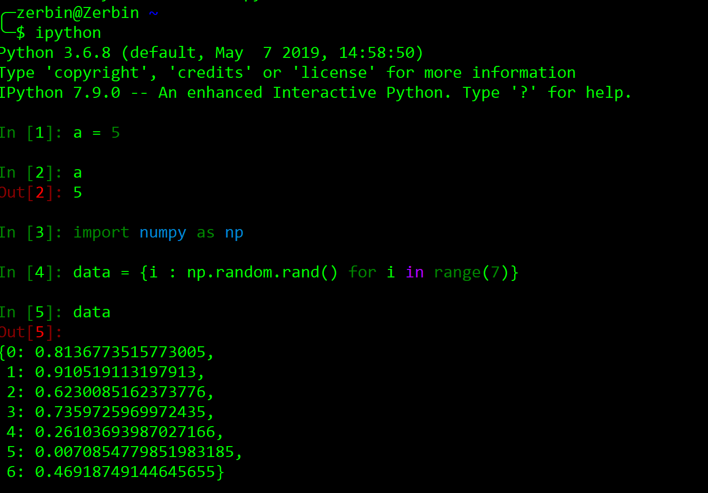
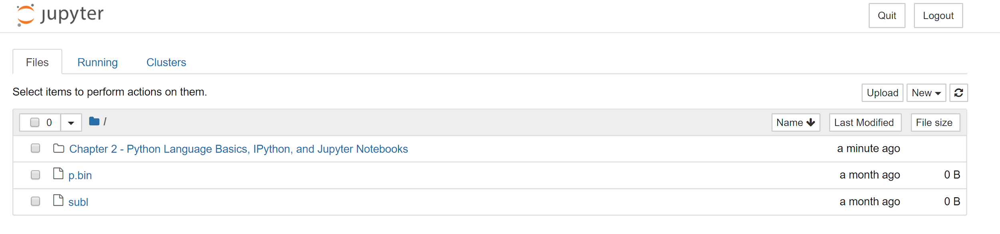

# Python Language Basics, IPython, and Jupyter Notebooks

* * *

* Python is an ideal language for rapidly whipping your data into shape

* The greater your facility with Python the language, the easier it will be for you to prepare new datasets for analysis

**The Python Interpreter**

* Python is an interpreted language

* It runs a program by executing one statement at a time

**IPython Basics**

* We’ll get up and running with IPython shell and Jupyter notebook, and introduce you to some of the essential concepts.

* The first two lines are Python code statements; the second statement creates a variable named *data* that refers to a newly created Python dictionary. The last line prints the value of *data *in the console.

**Running the Jupyter Notebook**

* One of the major components of the Jupyter project is *notebook*, a type of interactive document for code, text (with or without markup), data visualizations, and other output.

* Jupyter notebook interacts with *kernels*, which are implementations of the Jupyter interactive computive protocol in any number of programming languages.

* Python’s Jupyter kernel uses the IPython system for its underlying behavior.

* 

